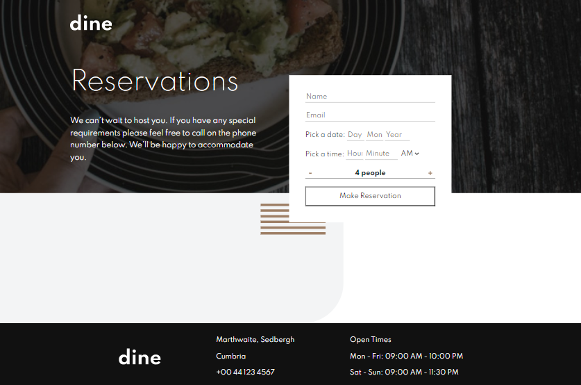
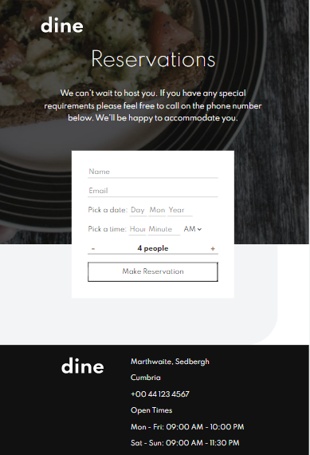

# Frontend Mentor - Dine Website Challenge solution

This is a solution to the [Dine Website Challenge challenge on Frontend Mentor](https://www.frontendmentor.io/challenges/dine-restaurant-website-yAt7Vvxt7). Frontend Mentor challenges help you improve your coding skills by building realistic projects.

## Table of contents

-  [Overview](#overview)
   -  [The challenge](#the-challenge)
   -  [Screenshot](#screenshot)
   -  [Links](#links)
-  [My process](#my-process)
   -  [Built with](#built-with)
   -  [What I learned](#what-i-learned)
   -  [Continued development](#continued-development)
   -  [Useful resources](#useful-resources)
-  [Author](#author)
-  [Acknowledgments](#acknowledgments)

**Note: Delete this note and update the table of contents based on what sections you keep.**

## Overview

### The challenge

Users should be able to:

-  View the optimal layout for each page depending on their device's screen size
-  See hover states for all interactive elements throughout the site
-  See the correct content for the Family Gatherings, Special Events, and Social Events section when the user clicks each tab
-  Receive an error message when the booking form is submitted if:
   -  The `Name` or `Email Address` fields are empty should show "This field is required"
   -  The `Email Address` is not formatted correctly should show "Please use a valid email address"
   -  Any of the `Pick a date` or `Pick a time` fields are empty should show "This field is incomplete"

### Screenshot

### Links

-  Solution URL: [Add solution URL here](https://github.com/ThomasAurelius/fm_dine-restaurant-website)
-  Live Site URL: [Add live site URL here](https://thomasaurelius.github.io/fm_dine-restaurant-website/)

## My process

### Built with

-  Semantic HTML5 markup
-  CSS custom properties
-  Flexbox
-  CSS Grid
-  Mobile-first workflow

### Continued development

I still need to figure out how the official design formatted the inputs the way the way they did. All other visuals are complete

### Useful resources

-Shoutout to Kevin Powell for teaching so much great CSS!

## Author

-  Website - [thomasaurelius.com](https://www.thomasaurelius.com)
-  Frontend Mentor - [@thomasaurelius](https://www.frontendmentor.io/profile/thomasaurelius)
-  Twitter - [@thomasaurelius4](https://www.twitter.com/thomasaurelius4)

## Acknowledgments

This is where you can give a hat tip to anyone who helped you out on this project. Perhaps you worked in a team or got some inspiration from someone else's solution. This is the perfect place to give them some credit.
